<div align="center">

# 🦊 Pixel Hero Agents

### A top-down pixel-art dashboard that visualizes your live Claude Code sessions as anthropomorphic animal heroes working in a tiny office.

*Every terminal becomes a hero. Every sub-agent becomes a sidekick. Every Bash, Edit, Read shows up on the office TV.*

[](https://opensource.org/licenses/MIT)
[](https://www.python.org/)
[](serve.py)
[](https://github.com/dwiaribowokj)

Original by [@rdwnilyas](https://instagram.com/rdwnilyas). Modified by [@dwiaribowokj](https://github.com/dwiaribowokj).

</div>

---

## ✨ What is this?

**Pixel Hero Agents** is a single-file web dashboard that watches `~/.claude/projects/` and renders every Claude Code session as a pixel-art character sitting at a desk in an open-plan office. When you spawn `Agent`, `Task`, or `Workflow` sub-agents, baby heroes appear and wander the floor, grid by grid, avoiding furniture.

It's part status panel, part dollhouse. Mostly dollhouse.

## 🎮 Features

- **🦊 15 anthropomorphic hero characters** — fox, wolf, cat, rabbit, bear, panda, otter, eagle, mouse, boar, squirrel, frog, dog, hedgehog, deer. Each Claude Code session gets a **unique** hero (no duplicates).
- **🐾 Sub-agent sidekicks** — when a session spawns `Agent` / `Task` / `Workflow` sub-agents, baby animals (matching the parent's species) wander the office grid-by-grid in 8 directions, avoiding desks, the tennis court, the dispenser, plants, sofas, and the TV.
- **🟢 Three live expressions per agent**
  - 💤 **sleeping** — no activity for > 5 minutes (desaturated, "Zzz" bubble)
  - 😊 **awake** — recent activity, working solo (idle wiggle + yellow PC glow)
  - 💪 **hard at work** — has running sub-agents (shake + red PC glow)
- **📺 Live activity TV** — green-CRT monitor in the lounge streams the last tool call per session in real time, color-coded by expression (red/yellow/grey).
- **🏢 Two zones**
  - **Work zone** — left-side floor with 3 standalone desks, a 2×2 hero block in the center, a water dispenser, plants, and a big green tennis court (with rackets).
  - **Lounge** — right-side white-tile floor with sofas, coffee tables, paintings, bookshelves, a wall clock, plus the activity TV.
- **🚪 A door between zones** — sub-agents physically walk through it. (And only through it.)
- **🧠 Stable assignment** — your hero, your desk, your slot. Re-renders don't shuffle anyone around. Pre-warmed cache means the first browser load is fast even with multi-megabyte JSONLs.
- **📡 Live local network access** — bind 0.0.0.0; show it on your phone, tablet, or to your office plant.

## 🦊 Meet the 15 Hero Agents

Each Claude Code session gets a **unique** hero from this anthropomorphic crew. Same index = same hero, so your terminal always reincarnates as the same character.

<table>
  <tr>
    <td align="center">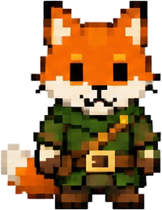<br/><b>00 — Fox</b></td>
    <td align="center">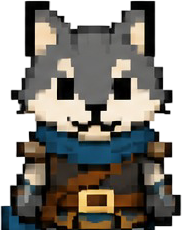<br/><b>01 — Wolf</b></td>
    <td align="center">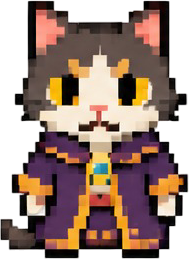<br/><b>02 — Cat</b></td>
    <td align="center">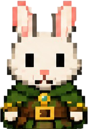<br/><b>03 — Rabbit</b></td>
    <td align="center">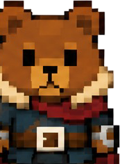<br/><b>04 — Bear</b></td>
  </tr>
  <tr>
    <td align="center">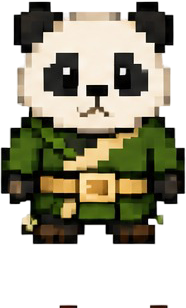<br/><b>05 — Panda</b></td>
    <td align="center">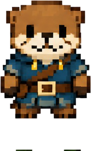<br/><b>06 — Otter</b></td>
    <td align="center">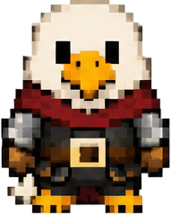<br/><b>07 — Eagle</b></td>
    <td align="center">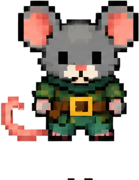<br/><b>08 — Mouse</b></td>
    <td align="center">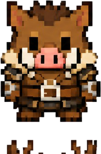<br/><b>09 — Boar</b></td>
  </tr>
  <tr>
    <td align="center">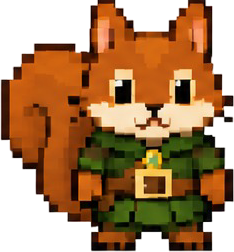<br/><b>10 — Squirrel</b></td>
    <td align="center">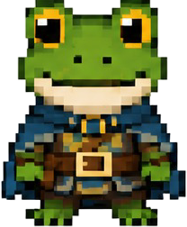<br/><b>11 — Frog</b></td>
    <td align="center">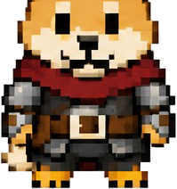<br/><b>12 — Shiba</b></td>
    <td align="center">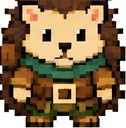<br/><b>13 — Hedgehog</b></td>
    <td align="center">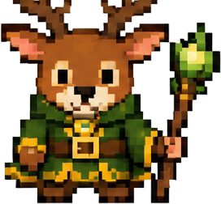<br/><b>14 — Deer</b></td>
  </tr>
</table>

## 🐾 …and Their 15 Sub-agent Sidekicks

When a session spawns an `Agent`, `Task`, or `Workflow` tool, a baby version of the parent's hero wanders the office floor — same species, smaller body, no work clothes.

<table>
  <tr>
    <td align="center">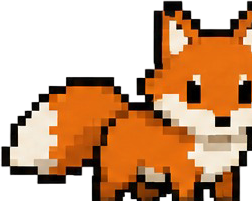<br/><sub>00 — Fox</sub></td>
    <td align="center">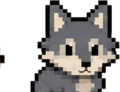<br/><sub>01 — Wolf</sub></td>
    <td align="center">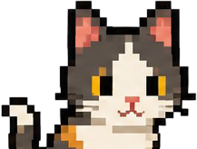<br/><sub>02 — Cat</sub></td>
    <td align="center">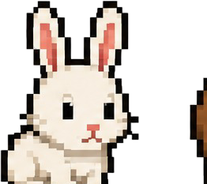<br/><sub>03 — Rabbit</sub></td>
    <td align="center">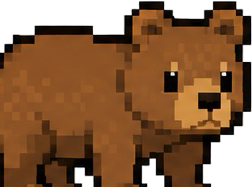<br/><sub>04 — Bear</sub></td>
  </tr>
  <tr>
    <td align="center">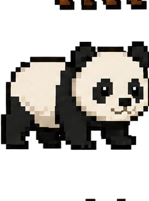<br/><sub>05 — Panda</sub></td>
    <td align="center">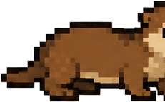<br/><sub>06 — Otter</sub></td>
    <td align="center">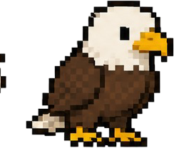<br/><sub>07 — Eagle</sub></td>
    <td align="center">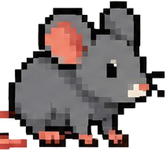<br/><sub>08 — Mouse</sub></td>
    <td align="center">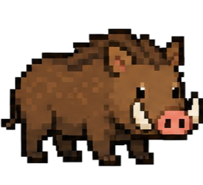<br/><sub>09 — Boar</sub></td>
  </tr>
  <tr>
    <td align="center">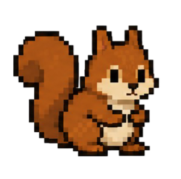<br/><sub>10 — Squirrel</sub></td>
    <td align="center">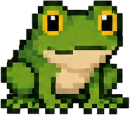<br/><sub>11 — Frog</sub></td>
    <td align="center">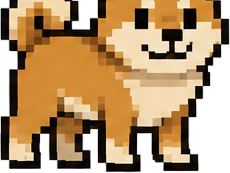<br/><sub>12 — Shiba</sub></td>
    <td align="center">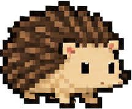<br/><sub>13 — Hedgehog</sub></td>
    <td align="center">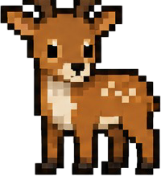<br/><sub>14 — Deer</sub></td>
  </tr>
</table>

## 📸 Screenshots

> Drop your own here once you've run it locally — `python serve.py` then open `http://localhost:5555/`.

## 🚀 Quick start

### Requirements
- Python 3.8+
- Claude Code installed (sessions live in `~/.claude/projects/*.jsonl`)
- A modern browser (Chrome/Edge/Firefox/Safari)

### Run

```bash
git clone https://github.com/dwiaribowokj/pixel-hero-agents.git
cd pixel-hero-agents
python serve.py
```

Then open **<http://localhost:5555/>** in your browser.

The first request triggers a one-time scan of every JSONL in `~/.claude/projects/` (~20–30s on a large history). After that, polling is sub-second from cache.

### Remote (LAN)

By default the server binds to `0.0.0.0:5555`. From another device on the same Wi-Fi, point a browser at your machine's IP:

```bash
http://<your-local-ip>:5555/
```

On Windows you may need a one-off firewall rule for inbound TCP 5555.

### Demo mode (no real sessions needed)

Append `?demo=12` to the URL to render 12 synthetic sessions with varying statuses:

```
http://localhost:5555/?demo=12
http://localhost:5555/?demo=30
```

Great for testing layouts without spawning real Claude Code processes.

## 🛠 How it works

```
~/.claude/projects/                    Python serve.py                    Browser
├── D--claude/                                                            ┌────────────┐
│   ├── 3df3319f-...jsonl       ──▶  scan_sessions()       ──▶ /api/...   │ desks      │
│   │   └── (Agent/Task/         (cached 10s, threaded,     (JSON)        │   ↑        │
│   │       Workflow tool_use    pre-warmed at startup)                   │ TV log     │
│   │       + tool_result)                                                │   ↑        │
│   └── ...                                                               │ sub-roamers│
└── ...                                                                   └────────────┘
```

- The server walks `~/.claude/projects/`, parses each `*.jsonl` for `tool_use` blocks named `Agent`, `Task`, or `Workflow`, matches them to `tool_result` entries to detect **pending** sub-agents, and also expands `Workflow` by counting `agent-*.jsonl` files inside `subagents/workflows/wf_*/`.
- Status threshold:
  - `active` — JSONL mtime < 30 s
  - `recent` — < 5 min
  - `idle` — < 1 hr
  - `sleeping` — older
- Polling: browser pulls `/api/sessions` every 2 s; server returns cached JSON (10 s TTL).
- The walkable grid is computed once per page load from the static furniture layout. Sub-roamers pick a random unblocked neighbor every 900 ms and teleport one tile (no transitions — strict grid stepping).

## 📂 Project layout

```
pixel-hero-agents/
├── serve.py              # ~330 LOC HTTP server. stdlib only. cached scanner.
├── index.html
├── style.css
├── app.js                # render, diff-update, sub-roamer pathing
├── assets/
│   ├── agents/           # 15 anthropomorphic hero sprites (cropped per character)
│   ├── subagents/        # 15 matching cute-animal sprites for sub-agents
│   ├── characters/       # base humanoid sheet (unused, kept for variants)
│   ├── furniture/        # desk, PC, chair, plant, sofa, bookshelf, … (from pixel-agents-hq)
│   ├── floors/           # tile PNGs
│   └── walls/            # auto-tiling wall strip
└── scripts/
    ├── crop_agents.py    # crops 5×3 sheet → 15 hero PNGs
    └── crop_subagents.py
```

## 🎨 Credits

- **Office furniture, floor, and wall tiles** are reused from [pixel-agents-hq/pixel-agents](https://github.com/pixel-agents-hq/pixel-agents) (MIT, © 2026 Pablo De Lucca). Big thanks — this would have taken weeks without them.
- **Hero & sub-agent character sheets** were AI-generated/provided by [@rdwnilyas](https://instagram.com/rdwnilyas) and cropped automatically by the `scripts/crop_*.py` tools.
- Tennis court, water dispenser, and TV CRT are hand-rolled SVG/CSS.
- Font: [Press Start 2P](https://fonts.google.com/specimen/Press+Start+2P) via Google Fonts.

## 🤝 Contributing

PRs welcome. Areas that could use love:

- More furniture / props
- A real `sub-agent` ⇒ `parent` pathing line (right now sub-roamers spawn near the parent and then wander freely)
- Persistent settings (zoom, panel positions, polling interval)
- Mobile-friendly layout (currently scaled for desktop)
- Theme variants (dark mode, day/night cycle, season skins)

Open an issue first if you're thinking of a big change.

## 📜 License

MIT — see [LICENSE](LICENSE). All assets shipped in this repo are MIT-compatible (see Credits).

---

<div align="center">

Modified with 🦊🐺🐱🐰🐻🐼🦦🦅🐭🐗🐿️🐸🐕🦔🦌 by <a href="https://github.com/dwiaribowokj">@dwiaribowokj</a>

</div>
